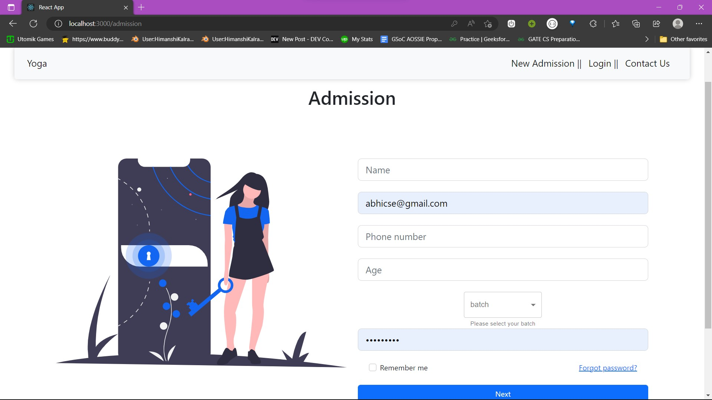
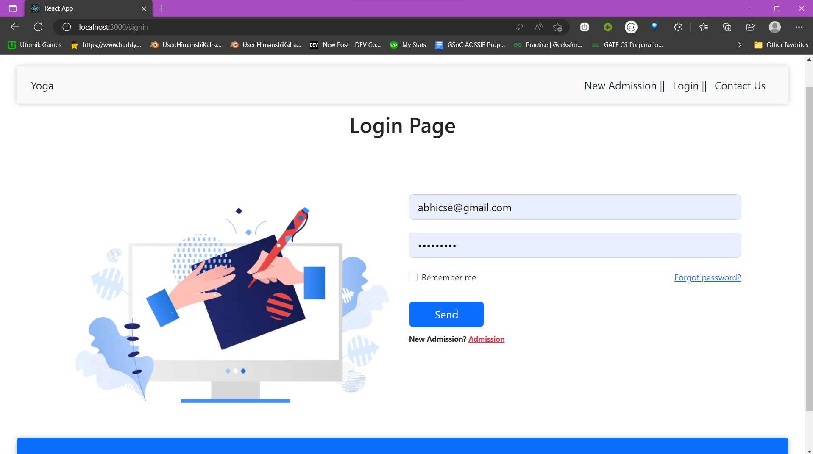
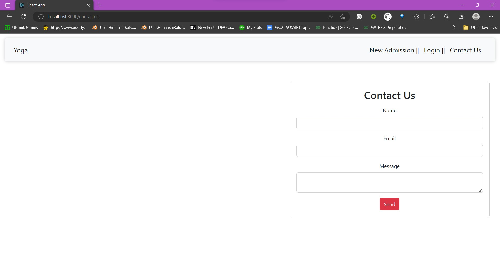
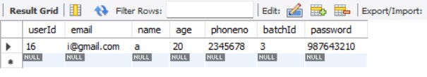
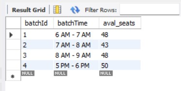
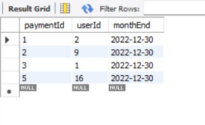
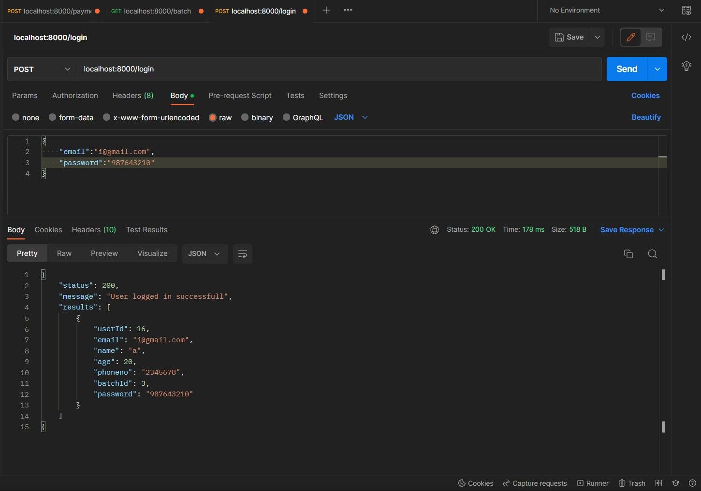
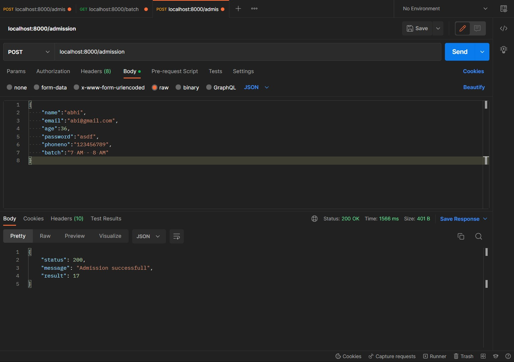
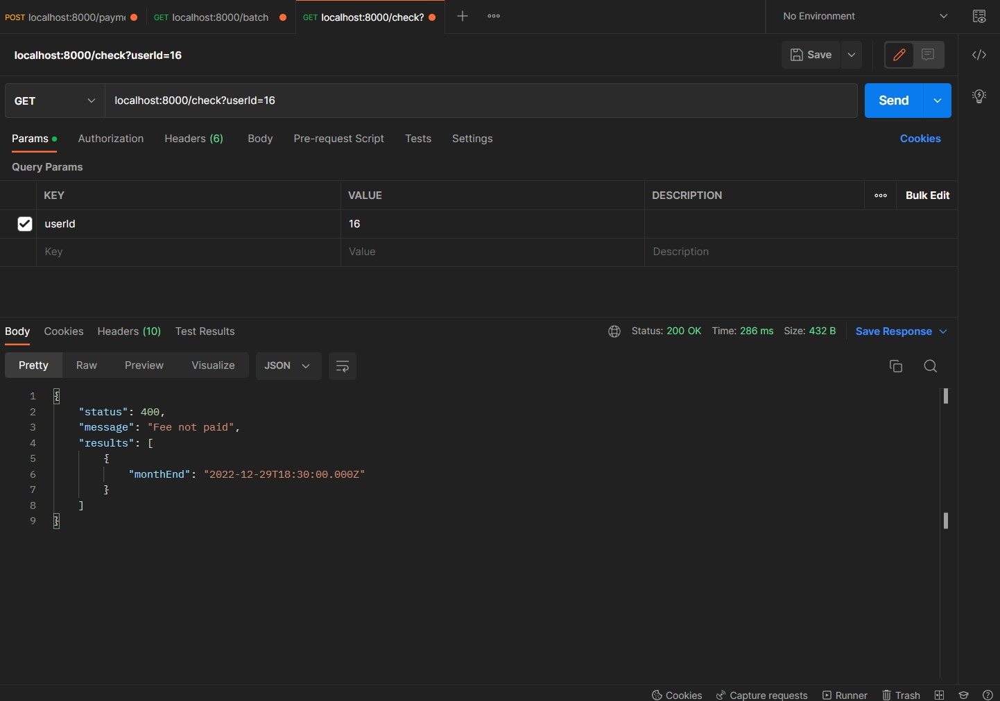
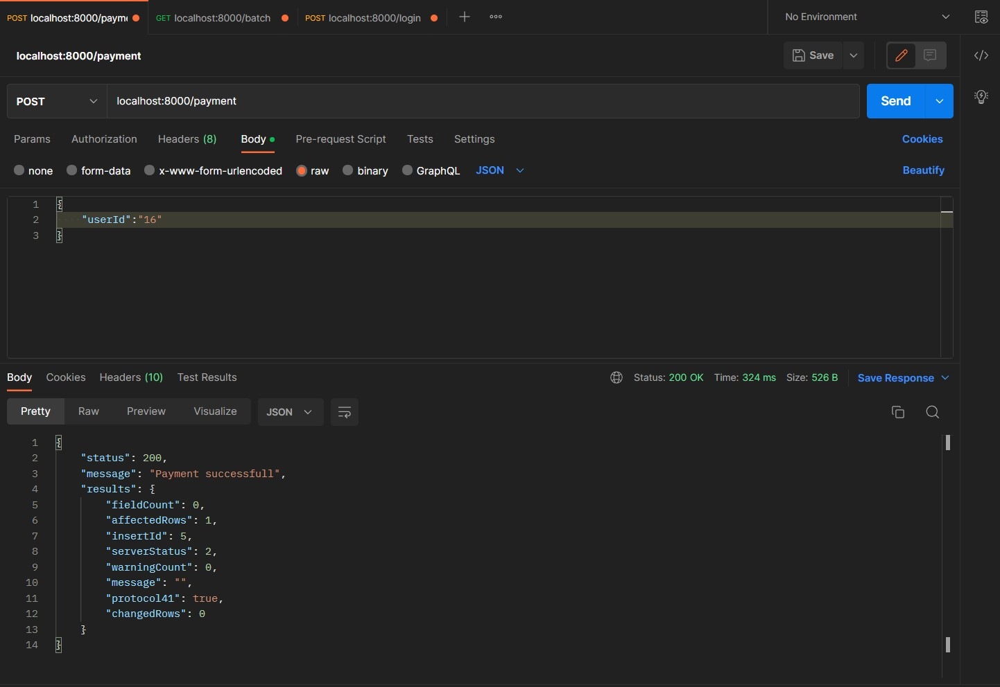

--Frontend
***
To start the project \
`npm install`\
`npm start`

once you have start the project you can see the server port running of localhost:3000

- localhost:3000/ (Home page)

 Here we are having Navbar and also the benifits of yoga \
 Either you can go through navbar or the buttons available at the bottom of the page .

 - localhost:3000/admission (To take new admission)
 
 This is the page to have new admission \
    in this we are accepting the `[name , email , age (between 18 - 65) , phone number , batches ({batch1:"6 AM - 7 AM"},{batch2:"7 AM - 8 AM"},{batch3:"8 AM - 9 AM"},{batch4:"5 PM - 6 PM"})]`
    Once you clicek on next Button it'll submit the request with suitable message and redirect you to next page of the website.

-localhost:3000/signin (Login page)

It'll accept the email and the password which is going to match from the database and pop up the suitable message.

-localhost:3000/contactus (Contact us Page)

    If you need any support anytime you can send the request to the CTO of the webiste.


****
****
--Backend
***
To start the backend Server \
`npm install`\
`npm start`

Table which I have made is - flexmoney \
```SQL
create database flexmoney;

use flexmoney;

create table batch(
	batchId int primary key Auto_Increment,
    batchTime varchar(255),
    aval_seats int 
);
create table users(
	userId int primary key Auto_Increment,
	email varchar(255) NOT NULL UNIQUE,
    name varchar(255) ,
    age int,
    phoneno varchar(255),
    batchId int references batch(batchId),
	password varchar(255)
);

create table payment(
	paymentId int primary key Auto_Increment,
    userId int References users(userId),
    monthEnd Date
);
```

```SQL
- Select * from users;
```


```SQL
- Select * from batch;
```



```SQL
- Select * from payment;
```



Let's Discuss the API we have made till now to solve the given problem

-localhost:8000/login (API To login user)

    
    We are going to send the user name and password to login the user in the json format.
    In return of whicich it'll send the userId data


-localhost:8000/admission (To add new User)

```JSON 
data need to send
[name , email , age (between 18 - 65) , phone number , batches ({batch1:"6 AM - 7 AM"},{batch2:"7 AM - 8 AM"},{batch3:"8 AM - 9 AM"},{batch4:"5 PM - 6 PM"})]
```
and in response of which it'll send the message and id of the user with the status code.

-localhost:8000/check (To Check the user is paid or not the money)

 This api is use to check the payment the of the user , accepts the user id 
 and return the response in the form of JSON as message it's valid or not and month end date till which it is valid


 -localhost:8000/payment (To make payment)

 Need to have only the user id and then when we call it it'll save the date in which we have paid the amount or the endMonth date
